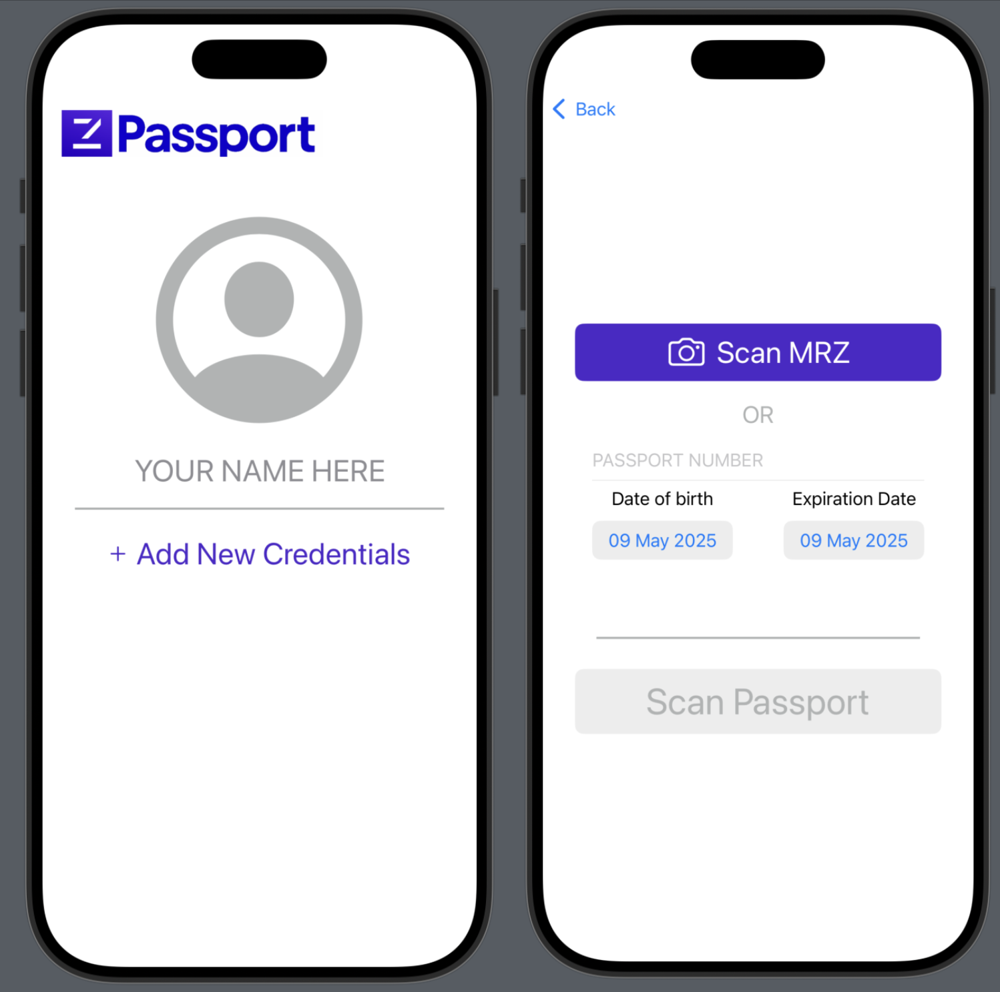
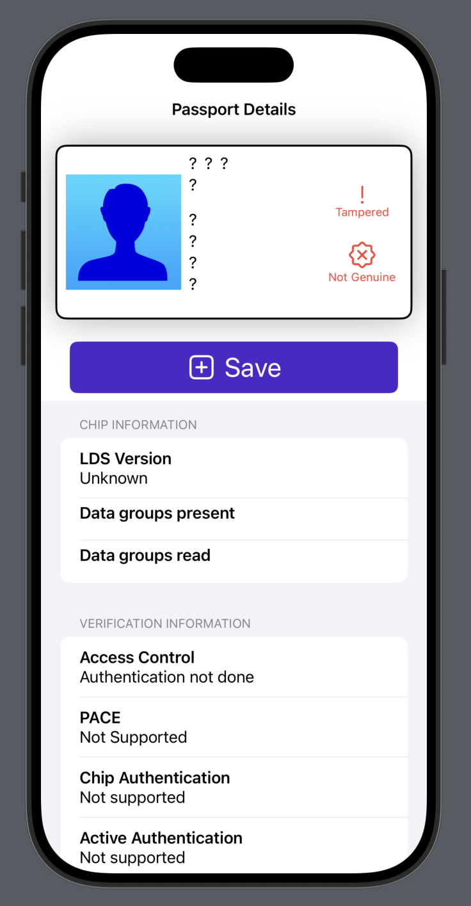

# zPassport (iOS)

Built on zero-knowledge cryptography and the Aleo blockchain, the zPass model enables private identity verification without revealing the underlying data.

zPassport is taking this concept one step further: using official digital passport data as the foundation for issuing zPass credentials. This approach builds directly on the existing infrastructure of trusted government-issued documents, transforming them into verifiable digital credentials. The result is a secure, interoperable bridge between real-world identity and privacy-preserving, verifiable digital identity.

This repository contains the source code for the zPassport iOS app.

## Testing

To try out the zPassport app, you can either download a beta version or clone this repository and build from source.

### Beta:
1. Download TestFlight from the App Store on your iOS mobile device.
2. Use this link to join the zPassport beta:  https://testflight.apple.com/join/sANHMANN
3.  You should be redirected to the TestFlight app, where you can install the zPassport app.

### From Source [MAC ONLY]:
1. Download and install the Xcode app on your Mac
2. Clone this repository and open within Xcode
3. You can build the project within Xcode and either display in the in-app emulator, or send it to your physical device.  Refer to the Xcode documentation for more details.

## Images

## TODO:
- Actually mint Aleo records from passport data once signature verification is possible
- Add way to delete saved passports

## Acknowledgements

This app is largely based on the [NFCPassportReaderApp](https://github.com/AndyQ/NFCPassportReader) repo.  All credit to Andy Qua on Github!

It reads my passport (and others I've been able to test) fine, however your milage may vary.
